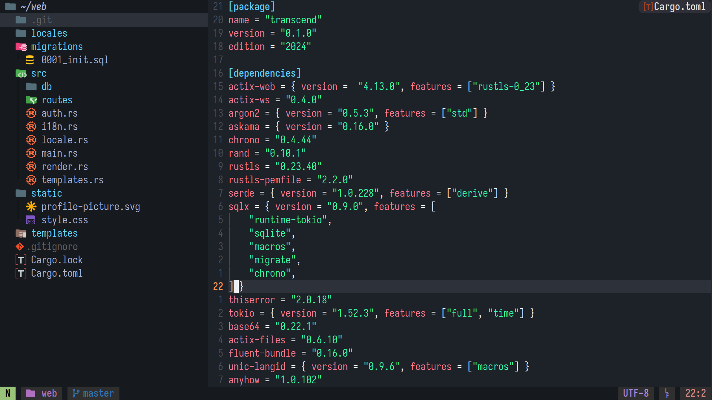
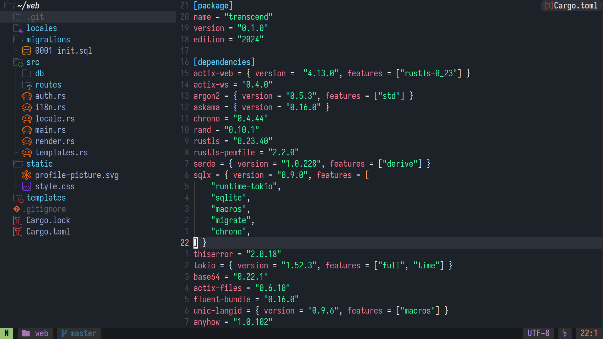
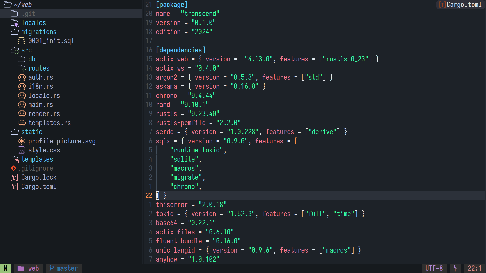
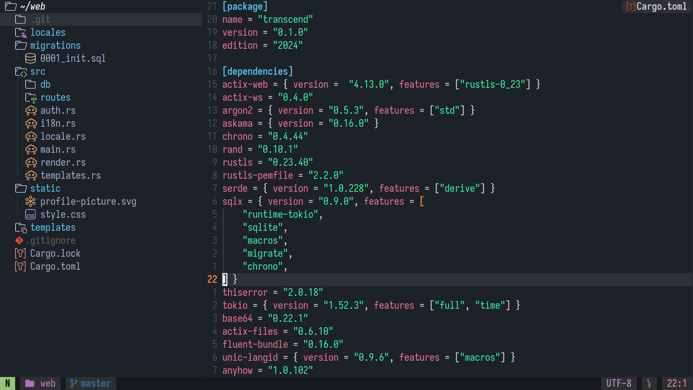

# COLR Icons

COLR Icons is a font and a NeoVim plugin that bring colorful icons to your terminals.

<p align="center">
    <br>
    Demo using catpuccin-frappe
</p>

# Table of Content

 - [Introduction](#introduction)
 - [Installing](#installing)
    * [Configuring](#configuring)
    * [Themes](#themes)
 - [Building](#building)
    * [Advanced usage](#advanced-usage)
 - [Glyphs](#glyphs)
 - [API](#api)
 - [Contributing](#contributing)
 - [Future plans](#future-plans)
 - [Attributions](#attributions)
 - [Changelog](#changelog)
 - [License](#license)

# Introduction

COLR Icons uses the [COLRv1](https://developer.chrome.com/blog/colrv1-fonts/) standard that enables fonts to have colored vector glyphs.
The font is built by bundling widely used icon sets, such as the [Material Icon Theme](https://github.com/material-extensions/vscode-material-icon-theme) into a single `.ttf` file.

COLR Icons glyph use the four-leaf-clover and maple-leaf emojis. Then, using ligature the display of these glyphs can be changed to any icon from the font. See [Glyphs](#glyphs) for more information.

COLR Icons also contains 'ligatures' made of basic icons and folder icons:
<p align="center">
    <br>
    Demo of ligatured icons
</p>

# Installing

1. Download the latest `COLR.Icons.ttf` in the [Release tab](https://github.com/ef3d0c3e/colr-icons/releases/tag/font).
2. Install the font by moving it either into `~/.fonts`, `~/.local/share/fonts` or `/usr/share/fonts`. Then run `fc-cache -vf` to update the font cache on your system.
3. Configure your terminal to use the font, this is usually done by indicating your terminal to use `COLR Terminal Icons` as a fallback.

All terminals that support COLRv1 should be compatible: Alacritty, Gnome terminal and Konsole should be compatible.

**WezTerm**
```lua
config.font = wezterm.font_with_fallback {
    -- Your regular font
    'Iosevka Nerd Font',
    -- COLR Icons, make sure to turn on harfbuzz ligatures
    { family = 'COLR Terminal Icons', harfbuzz_features = { 'calt=1', 'clig=1', 'liga=1' } },
}
```

**Kitty**
```
symbol_map U+1f340,U+1f341 COLR Terminal Icons
```

4. Install the neovim plugin:

**lazy.nvim**
```lua
{
    "ef3d0c3e/colr-icons",
    opts = {},
}
```

## Configuring

 * `integrations` The list of plugins integrations to enable:
    - `neo_tree` to enable integration with [neo-tree](https://github.com/nvim-neo-tree/neo-tree.nvim)
    - `snacks_picker` to enable integration with [snacks-picker](https://github.com/nvim-neo-tree/neo-tree.nvim)
 * `icons.theme_selection` The (ordered) list of icon themes to chose from.
 The plugin will try each theme in order if an icon is missing.
 Here's the list of all supported themes (see [Themes](#themes)):
    - `material`
    - `catpuccin-frappe`
    - `catpuccin-latte`
    - `catpuccin-macchiato`
    - `catpuccin-mocha`
 * `resolver.devicon_fallback` a boolean indicating whether to fallback to Devicon icons, requires [nvim-web-devicon](https://github.com/nvim-tree/nvim-web-devicons)

**Default configuration**
```lua
integrations = { "neo_tree", "snacks_picker" },
icons = {
    theme_selection = {
        "catpuccin-frappe",
        "material",
    }
},
resolver = {
    devicon_fallback = true, -- Will be turned off if nvim-web-devicon is not installed
},
```

## Themes

<p align="center">
    <br>
    Icons from the Material Icon Theme, using the <code>material</code> theme.
</p>
<p align="center">
    <br>
    Icons from Catpuccin-frappe, using the <code>catpuccin-frappe</code> theme.
</p>
<p align="center">
    <br>
    Icons from Catpuccin-latte, using the <code>catpuccin-latte</code> theme.
</p>
<p align="center">
    <br>
    Icons from Catpuccin-macchiato, using the <code>catpuccin-macchiato</code> theme.
</p>
<p align="center">
    <br>
    Icons from Catpuccin-mocha, using the <code>catpuccin-mocha</code> theme.
</p>

# Building

The project provides a build script, `build.sh`, that builds the composite SVGs and build the font using [nanoemoji](https://github.com/googlefonts/nanoemoji).

You must have the following installed (via pip)
 - `nanoemoji`
 - `tomllib`

You can then run `./build.sh` and wait for it to build the font in `build/COLR Icons.ttf`.

## Advanced usage

If you want to modify, contribute or simply understand how this project works, you should look at these files:

 - `gen.py` This script builds the composite ligature icons. It read from `config.toml` and generates the composite SVGs used by ligatures.
  This script will populate the `generated/` directory with composite SVGs, `generated/map.txt` (available in Releases) containing a list of all icons, it will also create `generated/ligatures.fea` containing informations to build ligatures.
 - `gen_table.py` This is a helper script that reads `config.toml` and generates a list of all glyphs except ligatures. It outputs a lua table to be used with the NeoVim plugin.

The file `config.toml` contains the list of icons.

Icons can be specified like this:
```toml
[icons.ICON_NAME.VARIATION]
svg = "icons/path-to-icon.svg"

# Examples
[icons.cmake.catpuccin-frappe]
svg = "icons/cmake-catpuccin-frappe.svg"

[icons.cmake.material]
svg = "icons/cmake-material.svg"

[icons.cmake.video.material]
svg = "icons/video-material.svg"
```

It's also possible to create new composites like so:
```toml
[compose.folder_cmake]
base = "folder" # Will make a subversion for all variations of `icons.folder`
badge = "cmake" # Will make a subversion for all variations of `icons.cmake`
```

In order to look good, you must specify a badge transform on the base icon you want to use as composite:
```toml
[icons.folder.material]
svg = "icons/folder-material.svg"
badge_anchor = [7, 5]
badge_scale = [0.6, 0.6]
```

This transform is then applied to the `badge` icon when generating the composite.

# Glyphs

All glyphs in this font use an emoji as prefix:
 - 🍀 for regular icons
 - 🍁 for *badged* icons (ligatures)

Then a specific icon can be chosen by adding [Variation Selectors](https://en.wikipedia.org/wiki/Variation_Selectors_(Unicode_block)).

For instance, the `database-catpucciun-latte` icon is encoded in the following way: `🍀 U+fe01 U+e01c6`:
 - `🍀` is the prefix for regular icons
 - `U+fe01` is variation selector 2
 - `U+e01c6` is variation selector 215

Similarly the `folder-material` icon is encoded like so: `🍀 U+fe02 U+e017a`

Here's the method to make a ligature from these two icons:
 - Strip the `🍀` prefix on both icons
 - Then concatenate: `🍁 <icon1> <icon2>`, and you've now got a ligature!

Below is some Lua snippet that does this:
```lua
BASE_CODEPOINT = "🍀"
BASE_CODEPOINT_LIGATURES = "🍁"

local function make_ligature(base, badge)
	return BASE_CODEPOINT_LIGATURES .. base:sub(BASE_CODEPOINT:len() + 1) .. badge:sub(BASE_CODEPOINT:len() + 1)
end
```

You can view the list of all glyphs in this font by downloading `map.txt` in the **Releases** tab.

# API

The plugin exposes an API to query icons:
```lua
-- Query icons from colr-icons only, returns `nil` if not found
require("colr-icons.resolver").resolve(opts)
-- Like `resolve`, but falls back to devicon or a placeholder if not found
require("colr-icons.resolver").resolve_with_fallback(opts)
```

Parameter `opts` is a table containing the following

```lua
{
    is_dir = true, -- Indicate whether the query is for a directory (will return a badged icon on success)
    is_open = false, -- Indicates whether the directory is open (should be false for regular files)
    filename = "my_file.lua", -- Filename
    ft = "lua", -- (optional) Filetype, can be inferred via `vim.filetype.match`
    path = "full_path_to_file", -- (optional) Full path to file on disk, currently unused
}
```

These functions return a table containing the following:
```lua
{
    text = "icon", -- Icon
    color = "#ff0000", -- (optional) color, only set when falling back to devicon
}
```

**Examples**
```lua
require("colr-icons.resolver").resolve_with_fallback({
    is_dir = false,
    is_open = false,
    filename = "init.lua",
    filetype = "lua",
})

require("colr-icons.resolver").resolve({
    is_dir = true,
    is_open = true,
    filename = "build",
    path = "/home/user/project/build",
})
```


# Contributing

Everyone is welcome to contribute to this project.

Make sure to report any bugs: invalid icons, incorrect composite SVGs or plugin bugs to the issue tracker.

# Future plans

 - Improve how the plugin picks icons
 - Use ligatures with the variation selector to reduce the number of codepoints occupied by the font
 - Support color blending on icons. COLRv1 allows it, but traditional (non Skia) rendering stacks are still behind
 - Better integrations with other NeoVim plugin

# Attributions

This project bundles icons from the [Material Icon Theme](https://github.com/material-extensions/vscode-material-icon-theme) and icons from [Catpuccin Icons](https://github.com/catppuccin/vscode-icons).
For proper COLRv1 support, the font bundles these emojis from Noto Emoji: 🍀 and 🍁.

Also, great thanks to [real-icons.nvim](https://github.com/Mirsmog/real-icons.nvim) for the idea and plugin integrations.

# Changelog

**1.1.0**
 - Remapped all icons from PUAs to emojis for proper COLRv1 support
 - Added support for Kitty
 - Improved font build time

# License

This project is licensed under [MIT](./LICENSE).

 * Catpuccin icons are licensed under [MIT](./LICENSE)
 * Material icons are licensed under [MIT](./LICENSE)
 * Noto Emoji emojis are licensed under [Apache 2.0](./LICENSE-APACHE-2.0)
