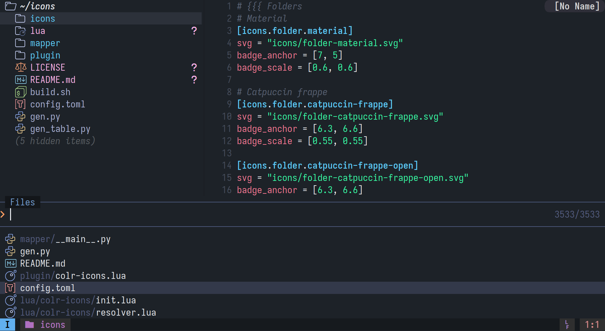
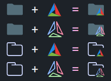

# COLR Icons

COLR Icons is a font and a NeoVim plugin that bring colorful icons to your terminals.

<p align="center">
    <br>
    Demo using catpuccin-frappe
</p>

# Table of Content

 - [Introduction](#introduction)
 - [Installing](#installing)
    * [Configuring](#configuring)
 - [Building](#building)
    * [Advanced usage](#advanced-usage)
 - [Contributing](#contributing)
 - [Future plans](#future-plans)
 - [Attributions](#attributions)
 - [License](#license)

# Introduction

The Unicode standard defines 3 [Private Use Areas](https://en.wikipedia.org/wiki/Private_Use_Areas) where third parties can add custom glyphs.
Projects like [Nerd Fonts](https://www.nerdfonts.com/cheat-sheet) already use these areas to add custom (monochrome) icons.

COLR Icons uses the [COLRv1](https://developer.chrome.com/blog/colrv1-fonts/) standard that enables fonts to have colored vector glyphs.
The font is built by bundling widely used icon sets, such as the [Material Icon Theme](https://github.com/material-extensions/vscode-material-icon-theme) into a single `.ttf` file.

COLR Icons glyphs resides in the *Supplementary Private Use Area-A (PUA-A)*, at codepoint U+F1F00. Currently, COLR Icons occupies the range `U+F1F00 - U+F2CBE`.

In order to embed even more icons in the font, COLR Icons uses ligatures to *fuse* icons together.
<p align="center">
    <br>
    Demo of ligatured icons
</p>

It is possible to embed even more icons than the private use areas can support, for instance by using [Unicode Variation Selectors](https://en.wikipedia.org/wiki/Variation_Selectors_(Unicode_block)).

# Installing

1. Download the latest `COLR.Icons.ttf` in the [Release tab](https://github.com/ef3d0c3e/colr-icons/releases/tag/font).
2. Install the font by moving it either into `~/.fonts`, `~/.local/share/fonts` or `/usr/share/fonts`. Then run `fc-cache -vf` to update the font cache on your system.
3. Configure your terminal to use the font, this is usually done by indicating your terminal to use `COLR Terminal Icons` as a fallback.

All terminals that support COLRv1 should be compatible: Alacritty, Gnome terminal and Konsole should be compatible.

**WezTerm**
```lua
config.font = wezterm.font_with_fallback {
    -- Your regular font
    'Iosevka Nerd Font',
    -- COLR Icons, make sure to turn on harfbuzz ligatures
    { family = 'COLR Terminal Icons', harfbuzz_features = { 'calt=1', 'clig=1', 'liga=1' } },
}
```

**Kitty**
Currently kitty is having issues rendering COLRv1 glyphs, I've filled out an [issue](https://github.com/kovidgoyal/kitty/issues/10209) on their repository.

4. Install the neovim plugin:

**lazy.nvim**
```lua
{
    "ef3d0c3e/colr-icons",
    opts = {},
}
```

## Configuring

 * `integrations` The list of plugins integrations to enable:
    - `neo_tree` to enable integration with [neo-tree](https://github.com/nvim-neo-tree/neo-tree.nvim)
    - `snacks_picker` to enable integration with [snacks-picker](https://github.com/nvim-neo-tree/neo-tree.nvim)
 * `icons.theme_selection` The (ordered) list of icon themes to chose from.
 The plugin will try each theme in order if an icon is missing.
 Here's the list of all supported themes:
    - `material`
    - `catpuccin-frappe`
    - `catpuccin-latte`
    - `catpuccin-macchiato`
    - `catpuccin-mocha`
 * `resolver.devicon_fallback` a boolean indicating whether to fallback to Devicon icons, requires [nvim-web-devicon](https://github.com/nvim-tree/nvim-web-devicons)

**Default configuration**
```lua
integrations = { "neo_tree", "snacks_picker" },
icons = {
    theme_selection = {
        "catpuccin-frappe",
        "material",
    }
},
resolver = {
    devicon_fallback = true, -- Will be turned off if nvim-web-devicon is not installed
},
```

# Building

The project provides a build script, `build.sh`, that builds the composite SVGs and build the font using [nanoemoji](https://github.com/googlefonts/nanoemoji).

You must have the following installed (via pip)
 - `nanoemoji`
 - `tomllib`

You can then run `./build.sh` and wait for it to build the font in `build/COLR Icons.ttf`.

## Advanced usage

If you want to modify, contribute or simply understand how this project works, you

 - `gen.py` This script builds the composite ligature icons. It read from `config.toml` and generates the composite SVGs used by ligatures.
  This script will populate the `generated/` directory with composite SVGs, `generated/map.txt` (available in Releases) containing a list of all icons, it will also create `generated/ligatures.fea` containing informations to build ligatures.
 - `gen_table.py` This is a helper script that reads `config.toml` and generates a list of all glyphs except ligatures. It outputs a lua table to be used with the NeoVim plugin.

The file `config.toml` contains the list of icons.

Icons can be specified like this:
```toml
[icons.ICON_NAME.VARIATION]
svg = "icons/path-to-icon.svg"

# Examples
[icons.cmake.catpuccin-frappe]
svg = "icons/cmake-catpuccin-frappe.svg"

[icons.cmake.material]
svg = "icons/cmake-material.svg"

[icons.cmake.video.material]
svg = "icons/video-material.svg"
```

It's also possible to create new composites like so:
```toml
[compose.folder_cmake]
base = "folder" # Will make a subversion for all variations of `icons.folder`
badge = "cmake" # Will make a subversion for all variations of `icons.cmake`
```

In order to look good, you must specify a badge transform on the base icon you want to use as composite:
```toml
[icons.folder.material]
svg = "icons/folder-material.svg"
badge_anchor = [7, 5]
badge_scale = [0.6, 0.6]
```

This transform is then applied to the `badge` icon when generating the composite.

# Contributing

Everyone is welcome to contribute to this project.

Make sure to report any bug, invalid icon, incorrect composite SVGs or plugin bugs to the issue tracker.

# Future plans

 - Improve how the plugin picks icons
 - Use ligatures with the variation selector to reduce the number of codepoints occupied by the font
 - Support color blending on icons. COLRv1 allows it, but traditional (non Skia) rendering stacks are still behind
 - Better integrations with other NeoVim plugin

# Attributions

This project bundles icons from the [Material Icon Theme](https://github.com/material-extensions/vscode-material-icon-theme) and icons from [Catpuccin Icons](https://github.com/catppuccin/vscode-icons).

Also, great thanks to [real-icons.nvim](https://github.com/Mirsmog/real-icons.nvim) for the idea and plugin integrations.

# License

 * Catpuccin icons are licensed under MIT
 * Material icons are licensed under MIT

This project is licensed under MIT.
